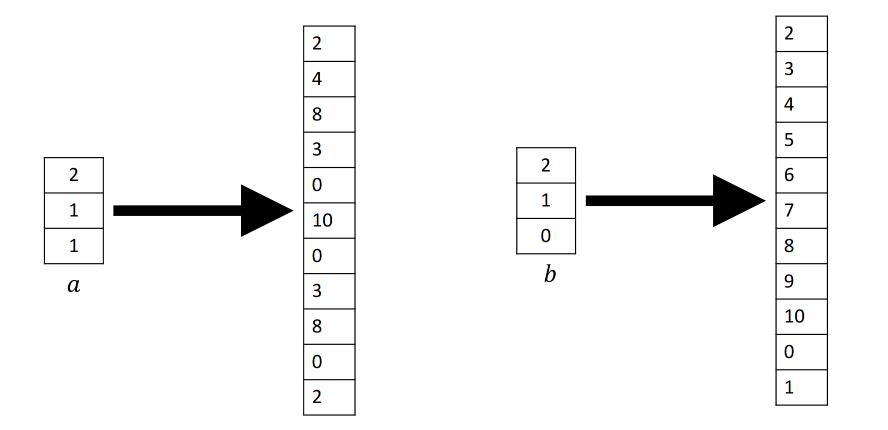

# Arithmetization

Stark101 前2个视频主要是描述如何做算术化（Arithmetization），我们学完之后应该能够回答三个问题：

1. Why：为什么需要算术化？
2. How：怎么做算术化？
3. What：算术化究竟做了什么？

## 1. Why

要解释原因，通常需要熟悉一个方案的构造框架。一个主流的 SNARK 方案构造框架以及基于FRI的SNARK构造框架（草图）如下：

证明系统的目的是：**证明一个计算的正确执行**。在计算机中，我们把计算（Computation）通常建模为电路，把计算的验证转换为电路的可满足问题（C-SAT），然后把电路的可满足问题规约成某些易证明语言，这种语言通常以多项式形式表达。最后利用证明系统对这个特定语言生成证明。

证明的过程本质上就是 Prover 把计算过程中产生的中间变量全部保存下来，形成一个执行轨迹（Execution Trace），诚实的Prover只需要证明它真的拥有着一条**满足计算约束的执行轨迹**即可。

> Q1: “某些易证明语言”是什么？
> 
> A1: 不同的证明系统选择的易证明语言不一样，比如Groth16的QAP问题，即判断是否存在一个多项式能够被一个公开的多项式整除；基于 IPA 的证明系统：判断一个多项式是否是零多项式。
> 
> Q2：能否直接证明电路可满足问题，而不经过这些“特定语言”？
> 
> A2: 当然可以！但是直接证明电路可满足性问题代价太大，比如 Prover 直接把运行轨迹发送给 Verifier ，且不考虑证明和验证复杂度，通信复杂度已与电路规模成线性关系。这开销远大于证明这些易证明的语言。

算术化的过程就是**把“存在一条运行轨迹满足计算运行约束”表达为一种易证明的语言**。举例，STARK101教程中， Prover 要证明它确实执行了 fibonacciSq 这个计算，并且把计算过程的中间变量（数列的每一个值）都保存下来，那么计算约束就是首项、尾项和递推公式，我们把计算约束。 Prover 证明了它的执行轨迹满足这三个多项式约束后，验证着即可相信。

因此做算术化的第一个原因就是：把计算的课验证问题转化成证明基于多项式的某些易证明语言，可以让证明更简洁。

对于基于 IOPP 的 STARK 方案，这还不够！我们深入讨论一下 IOP 和 IOPP 的差别。

IOP 证明系统框架来源于两个更古老的证明系统框架：IP和PCP，分别如图所示。

- IP（Interactive Proofs）：这是最早提出的交互式证明模型。在这个模型中，Prover 和 Verifier 进行多轮交互，交互结束后，Verifier 输出 0 或者 1，表示是否接受这次证明。
- PCP（Probabilistic Checkable Proofs）：在这个模型中，Prover和 Verifier 只进行一次交互，这一次交互中，Prover 向 Verifier 发送一个字符串，叫做PCP。和IP的主要区别是，Verifier 不需要读取完整的 PCP 字符串，而是可以对其进行随机访问。Verifier 计算结束后，输出 0 或者 1，表示是否接受这次证明。
- IOP（Interactive Oracle Proofs）其实就是 IP 和 PCP 的结合：它像IP一样允许多轮交互，而每一轮交互都是一个 PCP 模型，即 Verifier 可以随机访问 Prover 发来的字符串，但不需要读取整个字符串。多轮交互结束后，Verifier 输出 0 或者 1。

IOP 具有两个性质，分别是: Completeness，诚实的 Prover 和 诚实的 Verifier 一定使得协议输出为 1；Soundness，不诚实（执行计算）的 Prover 一定没有合法的执行轨迹，它所使用的假的执行轨迹只要和诚实的执行轨迹有一丁点不一样，整个协议以大概率输出 0。

IOPP（Interactive Oracle Proofs of Proximity）是 IOP 模型的变体，同样考察这两个性质，Completeness是一致的，但是 Soundness 的定义做了让步：不诚实（执行计算）的 Prover 一定没有合法的执行轨迹，它所使用的假的执行轨迹只要和诚实的执行轨迹差异较大，整个协议以很高概率输出 0。

有人可能会问：这怎么能行！？Prover 只需要知道一条跟诚实执行轨迹相差不大且符合计算约束的多项式，也可以通过 Verifier 的验证。那 Prover 作恶的机会大大增加了！

这也就引出了算术化在 STARK 中的第二个原因：STARK 的算术化确保了只要证明者不诚实执行整个计算，那么它的那条假的执行轨迹在算术化之后一定离真实的执行轨迹很远。这利用 Reed Solomon Code 这类纠错码的距离放大特性，后文会谈。

## 2. How

STARK101 前两节课的内容简单扼要地告诉我们如何做算术化，总结下来就是四板斧。

- 小域插值：在一个小域 $\langle g\rangle$ 上利用 lagrange 插值把执行轨迹编码成多项式 $f(X)$；

- 构建约束多项式等式：执行轨迹需要对首尾和中间状态进行三个约束，表示成3个多项式等式；

$$
\begin{aligned}
f(0)=1\\
f(1022)=2338775057\\
f(g^2X)=f^2(gX)+f^2(X)\\
\end{aligned}
$$

- 构造Rational多项式并合并：进一步地把多项式等式处理成 Rational 多项式，并通过随机线性结合（random linear combination）把三个多项式合并成一个多项式。 

$$
\begin{aligned}
  p_0(X)=\frac{f(X)-0}{X-g}\\
  p_1(X)=\frac{f(X)-2338775057}{X-g^{1022}}\\
  p_2(X)=\frac{f(g^2X)-f^2(gX)-f^2(X)}{\prod_{i=0}^{1020}{X-g^i}}=\frac{f(g^2X)-f^2(gX)-f^2(X)}{\frac{X^{1024}-1}{(X-g^{1021})(X-g^{1022})(X-g^{1023})}}\\
  p(X)=p_0(X) + \alpha_1p_1(X)+\alpha_2p_2(X)
\end{aligned}
$$

- 大域求值：在一个更大的域上 $\langle l\rangle$ 对所有元素求它们 $f(x)$ 的求值。

正确的，但要知道其中道理，我们需要掌握更多的知识。

### Prelimilary

为了理解算术化的本质，我们需要了解三个数学基本构件，分别是有限域，多项式和Reed-Solomon编码。这里仅列出部分让本文自洽的定义和定理。

#### Finite Field

- 素数阶有限域的乘法群构成循环群。（费马小定理可证）
- 循环群的子群也是循环群。（反证法）
- 循环群必是 Abel 群。
- 拉格朗日定理（Lagrange Theorem）：设 $H$ 是有限群 $G$ 的子群，则 $|H|$ 的阶整除 $|G|$ 的阶。
- 陪集（coset）：给定群 $G$ 及其子群 $H$ 。定义左陪集为 $\set{g \circ h \quad \forall h\in H}$ ，其中 $g\in G$。右陪集同理。Abel 群的左右陪集相同。

1. 为了能在“小域”上插值，在“大域”上求值，我们需要找到两个乘法子群（一小一大）。
   
  计算素数阶有限域 $\mathbb{F}_p$ 上所构成的乘法循环群 $\langle g\rangle$ 的 $d$ 阶乘法子群的生成元 $w$： 

  $$
  w=g^{(p-1)/d}
  $$

2. 上述从“小域”到“大域”的 blowup，并不是简单地扩大到一个规模更大的乘法子群，而是要取这个大域上的 coset。

    为什么取 Coset？目前的观点是起到隔离作用。同样的技巧可以参考[郭老师文章](https://learn.z2o-k7e.world/plonk-intro-cn/plonk-constraints.html#%E4%BD%8D%E7%BD%AE%E5%90%91%E9%87%8F%E7%9A%84%E4%BC%98%E5%8C%96)。

#### Polynomial over Finite Field

考虑有限域 $\mathbb{F}_p$ 上的 $n$ 次单变量多项式。

- $f(X)=\sum_{i=0}^{n-1}{f_iX^i}$ ，其中 $f_i,X\in \mathbb{F}_p$ 。
- Fact 1： $n + 1$ 个点唯一确定一个 $n$ 次多项式。
- 代数基本定理（Foundamental Theorem of Algebra）： $n$ 次多项式至少有 $n$ 个零点。
- 拉格朗日插值：给定一个点向量 $\vec{f}=\set{(x_0, y_0), \dots, (x_{n-1}, y_{n-1})}$，使用 lagrange插值法计算穿过这些点的多项式： $f(X)=\sum_{i=0}^{n-1}{y_i L_i(X)}$，其中 $L_i=\prod_{j=0, j\ne i}{\frac{X-x_j}{x_i - x_j}}$。

    Intuition：这个方法的思路在于设计一个 Basis 多项式 $L_i(X)$，使得当 $X=x_i$ 时，输出为 1；否则输出为 0。
- Schwazch Zipple lemma：有限域 $\mathbb{F}_p$ 上任意两个不同的 $n$ 次多项式在大多数点上的取值不同。
  
  给定两个多项式 $f(X),g(X)$ ，在有限域任取一元素 $a$ 对两个多项式求值，如果 $f(a)=g(a)$ ，则认为它们是相同的多项式，出错的概率为 Soundness error = $\frac{n}{p-1}$。由于 $n\ll p$，因此错误的概率很低。
- Low Degree Extension (LDE)
  
  - Extension：给定一个函数映射 $f: \set{0,1}^v\rightarrow\mathbb{F}$，如果一个 v 元多项式 $g(\cdot)$ 满足 $f$ 的所有映射关系，那么称这个多项式 $g(\cdot)$ 是函数映射 $f$ 的扩展（extension）。
  - Low Degree：关于低次的定义是根据上下文变化的，但至少 $g(\cdot)$ 的次数不大于有限域的规模。
    - 在 STARK 上下文中，低次的定义是不大于“小域”的规模。   
  
  人们的一个误区是：以为 LDE 是一个单独的算法。但其实 LDE 其实描述一种寻找多项式来扩展原始函数映射的思想。很多工具都可以实现这种思想，上述的 lagrange 插值法就是找到 LDE 中所定义的多项式的一种常用方法。

  非常重要的一点：LDE 赋予了向量（或者函数映射）一种距离放大（distance amplifying）的特性。函数映射本身的表现力局限在本身的定义域上，这样两个映射之间的差异其实是细微的（或者说差异很小）。但是如果将它们扩展成多项式，那么在一个更大的域上取值求得的向量，再比较，则差异就显著起来。下面是 PAZK 中对 LDE 距离放大特性的展示。

  

#### Reed Solomon Code

编码理论，故名思义，一门研究对消息进行编码的理论。编码的过程为 $enc:\Sigma^k\rightarrow\Sigma^n$，解码是其反向操作。其中 $\Sigma$ 表示字母表， $k$ 表示原始消息（message）长度， $n$ 表示编码之后的码字（codeword）长度。

- 一个码（Code）对应着一个 n 维向量空间的子空间，记作： $C\subseteq\mathbb{F}^n$，
  
  - 也就是说，一个码是向量的集合。
  - 码字（Codeword）是这个向量集合中的任意元素，码元（code symbol）是码字向量中的任意元素。
  - 码的维度指消息的长度： $\dim C=k$。
  - 码率： $\rho=k/n$
  - 最小汉明距离： $d=\min_{u,v\in C, u\ne v}\Delta(u,v)$。其中 $\Delta$ 表示两个码字之间汉明距离，也就是不同的码元个数。我们用最小汉明距离来刻画码字之间的差异程度。
  - 最小汉明重量： $w=\min_{v\in C}\text{码字v中非零码元个数}$。
  
  我们期望编码之后，对消息的传递具有一定增益，比如检错和纠错。如何带来增益？原理就是增加码字之间的距离。任意两个码字之间的距离增大，意味着我们纠错的范围越大，更容易恢复原始消息。但伴随而来的缺陷是：码率降低，编码速率降低。因此在设计纠错码时会有权衡（trade-off）。

  纠错码的检错和纠错能力使用最小汉明距离 $d$ 描述：
  - 检错能力： $d-1$,
  - 纠错能力： $\lfloor\frac{d-1}{2}\rfloor$

- 线性码
  - 线性码是一类纠错码，定义为： 一个线性码码（Linear Code）对应着一个 n 维向量空间的线性子空间，记作： $C\leqslant\mathbb{F}^n$。
  - 线性是说：给定两个码元 $u,v\in C$，两个有限域元素 $\alpha, \beta$，则 $\alpha u+\beta v\in C$。
  - 线性码中，最小汉明距离和最小汉明重量是等价的。
  - 习惯上会把参数附加上，比如 $[n, k]$-线性码， $[n, k, d]$-线性码，或者 $[n, \rho, d]$-线性码。（用 $k$ 还是 $\rho$ 取决于自己偏好，反正知道 $n,k,\rho$ 其二即可）
  - Singleton Bound： $[n,k]$-线性码的最小汉明距离 $d\le n-k+1$
  
- Reed Solomon Code
  
  - RS码是一类 $[n, \rho, d]$-线性码，早在1960年提出，名为“Polynomial code over Certain Finite Field”。
  - 定义： $C=\set{(p(a_0), p(a_2), \dots,p(a_{n-1}))|p\text{ is a polynomial over } \mathbb{F}_p\text{ of order } <k}$
  - 本质上它编码的消息是任意次数小于 $k$ 的单变量多项式 $f(X)=\sum_{i=0}^{k-1}{f_iX^i}$ ，码字是这个多项式在一个有限集合 $\set{x_0,\dots, x_{n-1}}$ 上取值所组成的「值向量」。
  
$$
    RSCodeword=\begin{pmatrix}
    x_0^0 & x_0^1 & \dots & x_0^{k-1}\\
    x_1^0 & x_1^1 & \dots & x_1^{k-1}\\
    \vdots & \vdots & \ddots & \vdots\\
    x_{n-1}^0 & x_{n-1}^1 & \dots & x_{n-1}^{k-1}\\
    \end{pmatrix}
    \begin{pmatrix}
    f_0\\
    f_1\\
    \vdots\\
    f_{k-1}
    \end{pmatrix}
$$

  - 显然RS码的消息属于 $q^k$ 的向量空间，码字属于 $q^n$ 的向量空间。而线性性质是由有限域上多项式赋予的。
  - 考虑RS码的最小汉明距离： $d=\Delta(u,v)$。其实是长度为 n 的两个多项式「值向量」的差异。由于RS码的消息（多项式） $p(X)$ 的次数 $\le k-1$，根据代数基本定理我们知道，其在 $\mathbb{F}_p$ 上的零点个数也要 $\le k-1$。那么在大小为 $n$ 的有限集合上取值，非零点的个数 $\ge n-k+1$。于是码字的汉明重量 $w\ge n-k+1$。又由于线性码的最小汉明距离和最小汉明重量是等价的，所以码字的汉明最小汉明距离 $d\ge n-k+1$。而根据 Singleton Bound $[n,k]$-线性码的最小汉明距离 $d\le n-k+1$，因此 RS 码的最小汉明距离等于 $n-k+1$。
  - 因此，RS码是 $[n,k,n-k+1]$-线性码。

### Revisit Arithmetization

重新审视本节开头的算术化四板斧。

1. 小域插值：把运行轨迹向量插值成多项式。（LDE）
2. 构建约束多项式等式：用多项式等式来表明域执行轨迹确实满足约束。
3. 构造Rational多项式并合并：多项式等式并不很好处理，我们采用类似 KZG 的多项式等式处理策略，转而证明存在一个有理多项式，满足这个等式。但是，和KZG不同的是：Verifier不需要知道这个有理多项式具体是什么，而是证明这个有理多项式小于某个特定的次数（即小域的size）。这就避免了使用 KZG 引入的 pairing 的带来的各种不便（可信初始化，pairing-friendly curve等）。合并时，采用随机线性组合。
4. 大域求值：在整个大域求值。（得到RS码字）

## 3. What

回顾整个 STARK 整个 Arithmetization 过程，其实操作上总结下来就四步。

但是 Prover 的任务从“诚实地运行了计算，并且把计算过程中产生的中间值保存了下来”这样一个电路可满足问题，规约（Reduce）到“证明一个RS码字它对应的那个多项式次数小于某个特定的值（小域的size）”。后者这个问题被称为RPT问题

$$
\text{C-SAT}\Rightarrow\text{RPT}
$$

Arithmetization 使得证明更加简洁（succinct）。

## 4. Other

对于STARK101前两个视频，还有几个细节需要补充。

- `channel.py` 用于实现 fiat-shamir 变换，为证明系统实现非交互式。即通过hash函数来模拟verifier发送随机数，当然toturial实现得比较简单，但起到教学作用。
- `merkle.py` 用于实现向量承诺，我们需要对在小域上插值的多项式进行向量承诺，这个作用会在 FRI 中提及。

