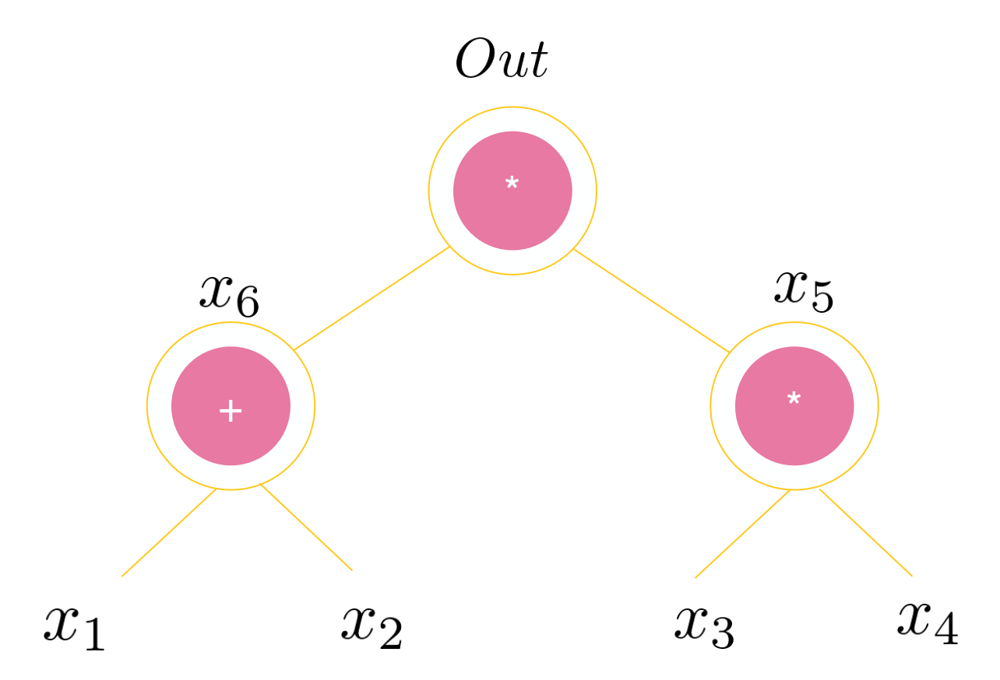

# 01. R1CS V.S. Plonkish

<table>
  <tr>
    <th>title</th>
    <th>tags</th>
  </tr>
  <tr>
    <td>01. R1CS_Plonkish</td>
    <td>
      <table>
        <tr>
          <th>zk-meme</th>
          <th>basic</th>
          <th>quick_read</th>
          <td>R1CS_Plonkish</td>
        </tr>
      </table>
    </td>
  </tr>
</table>

[Github](https://github.com/ETAAcademy)｜[Twitter](https://twitter.com/ETAAcademy)｜[ETA-ZK-Meme](https://github.com/ETAAcademy/ETAAcademy-ZK-Meme)

Authors: [Eta](https://twitter.com/pwhattie), looking forward to your joining

## Plonkish Arithmetization

Plonkish Arithmetization represents a significant advancement in Zero-knowledge proofs (ZKPs) that allow one party, the Prover, to prove to another party, the Verifier, that a statement is true without revealing any additional information. Let's delve into the intricacies of Plonkish Arithmetization and its comparison with the well-established R1CS framework.

### 1. R1CS: A Foundation in Multiplication Gates

R1CS, or Rank-1 Constraint Systems, **revolves around multiplication gates**, where three "selector" matrices - U, V, and W - designate the "left input", "right input", and "output" of each multiplication gate, respectively, 1 of which indicates involvement in computations and 0 non-involvement. The selector matrix usually has a number of columns equivalent to the number of variables, with the number of rows matching the count of multiplication gates. Additionally, R1CS accommodates constant multiplication gates, a special case treated as addition gates.

 

Consider a scenario where we have four input variables labeled $(x_1, x_2, x_3, x_4).$ In this scenario, $x_5$ acts as the output of the second multiplication gate and also functions as the right input of the first multiplication gate, while \(out\) represents the output of the first multiplication gate.

$$\vec{a} = (x_1, x_2, x_3,x_4,x_5,out)$$

Imagine a circuit with multiplication gates. Three matrices \(U\), \(V\), and \(W \in \mathbb{F}^{n\times m}\) describe how the gates are connected (circuit's setup). W is a table with rows matching the number of gates (n) and columns hinting at the number of wires (m). Each row in W tells how the corresponding gate connects its inputs and output.

Left input matrix \(U\):

$$
\begin{array}{|c|c|c|c|c|}
\hline
x_1 & x_2 & x_3 & x_4 & x_5 & out & \texttt{i} \\
\hline
1 & 1 & 0 & 0 & 0 & 0 & \texttt{1}\\
\hline
0 & 0 & 1 & 0 & 0 & 0 & \texttt{2}\\
\hline
\end{array}
$$

Right input matrix \(V\):

$$
\begin{array}{|c|c|c|c|c|}
\hline
x_1 & x_2 & x_3 & x_4 & x_5 & out &\texttt{i}\\
\hline
0 & 0 & 0 & 0 & 1 & 0 & \texttt{1}\\
\hline
0 & 0 & 0 & 1 & 0 & 0 & \texttt{2}\\
\hline
\end{array}
$$

Output matrix \(W\):

$$
\begin{array}{|c|c|c|c|c|}
\hline
x_1 & x_2 & x_3 & x_4 & x_5 & out & \texttt{i}\\
\hline
0 & 0 & 0 & 0 & 0 & 1 & \texttt{1}\\
\hline
0 & 0 & 0 & 0 & 1 & 0 & \texttt{2}\\
\hline
\end{array}
$$

We can easily verify the following equation:
$$(U \cdot \vec{a}) \circ (V \cdot \vec{a}) = (W \cdot\vec{a})$$

## 2. Plonkish Arithmetization: A Leap Forward

Plonkish arithmetization is a more efficient way to express circuits for zero-knowledge proofs:

**Circuit Setup:**

Instead of three tables (U,V,W) with potentially many columns, Plonk uses a single W table with just 3 columns to reduces complexity.

Plonk can handle more than just addition and multiplication gates, such as comparisons, lookups, and even memory access (RAM).

**Key Tables: $\mathsf{Plonkish}_0 \triangleq (Q, \sigma;$ W)**

- W table: Stores assignments (secret).
- Q table (Selector): Defines operation for each row (addition or multiplication).
- Permutation table: Ensures consistency when values are moved around in W.

We define a matrix $W\in\mathbb{F}^{n\times 3}$ to represent constraints where n is the number of arithmetic gates):

$$
\begin{array}{c|c|c|c|}
i & w_a & w_b & w_c  \\
\hline
1 & \boxed{x_6} & \underline{x_5} & [out] \\
2 & x_1 & x_2 & \boxed{x_6} \\
3 & x_3 & x_4 & \underline{x_5} \\
4 & 0 & 0 & [out] \\
\end{array}
$$

To distinguish addition and multiplication, we define a vector $Q\in\mathbb{F}^{n\times 5}$ to represent operators:

$$
\begin{array}{c|c|c|c|}
i & q_L & q_R & q_M & q_C & q_O  \\
\hline
1 & 0 & 0 & 1 & 0& 1 \\
2 & 1 & 1 & 0 & 0& 1 \\
3 & 0 & 0 & 1 & 0& 1 \\
4 & 0 & 0 & 0 & out& 1 \\
\end{array}
$$

Permutation proofs confirm this consistency post rearrangement, verified by Prover.

$$
\begin{array}{c|c|c|c|}
i & w_a & w_b & w_c  \\
\hline
1 & \boxed{x_6} & \underline{x_5} & out \\
2 & x_1 & x_2 & \boxed{x_6} \\
3 & x_3 & x_4 & \underline{x_5} \\
\end{array}
$$

If three or more vector positions must share a value, Prover cyclically shifts them, ensuring equality with the original.

$$
  A = (b_1, b_2, \underline{a_1}, b_3, \underline{a_2}, b_4, \underline{a_3}) =  (b_1, b_2, \underline{a_3}, b_3, \underline{a_1}, b_2, \underline{a_2}) = A'
$$

To ensure that $w_c$ in the first row equal to the out variable, an additional copy constraint is added to the $\sigma$ matrix. In short, if the Prover is honest, then for $i \in (1,2,3,4),$ the following arithmetic constraint equation holds:

$$
q_{L,i} \circ w_{a,i} + q_{R,i} \circ w_{b,i} + q_{M,i}\circ(w_{a,i}\cdot w_{b,i}) + q_{C,i} -  q_{O,i}\circ w_{c,i} = 0
$$
